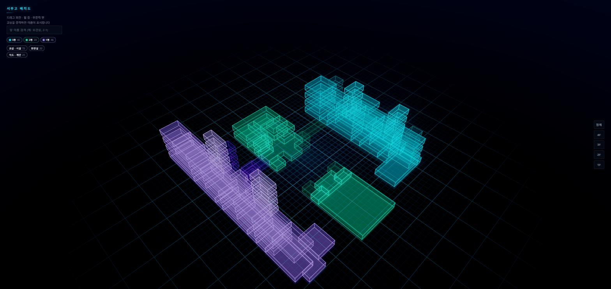

# DSHS 3D Interactive Map

대구서부고등학교 건물 배치도를 3D로 탐색하는 웹앱.
Sweet Home 3D 도면(`.sh3d`)에서 방 정보를 뽑아 홀로그램 스타일로 렌더링한다.



현재 4개 층 178개 방을 담고 있다. (2026-07-28 최종 도면)

| 층 | 방 | 면적 |
|---|---|---|
| 1층 | 44 | 2760.2 m² |
| 2층 | 47 | 2857.9 m² |
| 3층 | 50 | 2841.5 m² |
| 4층 | 37 | 2164.0 m² |

---

## 기능

- **시점 프리셋** — 우측 위 `기본` / `평면` / `정면`. 방향만 정해두고 거리는 그때 보이는
  방들에 맞춰 다시 재므로, 층을 하나만 켜둔 상태에서 눌러도 그 층에 딱 맞게 잡힌다
- **층 전환** — 전체 스택 뷰 / 층별 격리 (우측 버튼)
- **방 이름표** — 층별 뷰에서 방마다 중심에 이름이 뜬다. 시점을 어떻게 돌려도 정면을
  보고 글자 크기가 그대로다. 홀은 제외 (바닥판이라 이름을 띄워도 얻는 게 없다)
- **방 선택** — 클릭하면 카메라가 그 방으로 날아가고, 나머지는 눌러서 대비를 만든다
- **동·종류 필터** — 색 범례를 겸하는 칩. 3동 시안 / 4동 푸시아 / 2동 청록 / 1동 보라
  (4동은 중앙 도서관 `하늬글샘` 이 있는 동쪽 블록. 2층 `421`~`423`, 3층 `431`~`435` 가 여기다)
- **홀은 동과 무관하게 한 색, 그리고 납작하게** — 여러 동을 잇는 공용 공간이라 동 색을
  따르면 소속이 있는 것처럼 읽힌다. 슬레이트(`#94a3b8`) 한 색에 30cm 슬래브로 눕혀
  바닥판처럼 깐다. 색은 `typeColors`, 높이는 `typeHeights` 에서 바꾼다
- **이름이 같은 홀은 한 객체** — 벽으로 나뉘어 그려졌을 뿐 실제로는 이어진 한 공간이라,
  호버·선택·면적 합계를 묶음 단위로 본다. 홀이 아닌 이름 중복은 객체를 따로 두고 검색에서만 묶는다
- **계단실·엘리베이터는 기둥 하나로** — 층마다 떠 있는 상자가 아니라 1층부터 꼭대기까지
  이어진 육면체로 보인다 (`plan.config.json` 의 `shaftWords`)
- **이름 검색** — 부분 일치, ↑↓ 이동, Enter 선택. 필터에 가려진 방을 고르면 필터를 자동으로 풀어준다
- **같은 이름은 한 줄로** — 같은 층에 이름이 같은 방이 여럿이면(`1층 홀` 3개, `꿈돋움 라운지`
  2개 …) 결과가 한 줄로 합쳐지고 `· 3곳` 이 붙는다. 고르면 전부 같이 켜지고 카메라도 전체를 잡는다
- 계단·엘리베이터는 클릭 대상에서 제외 (교실을 가리기 때문)
- **카메라 한계** — 줌 아웃은 전체가 들어오는 거리의 1.6배까지, 회전은 수평선까지.
  더 빼면 건물이 안개 속 점이 되고, 바닥 아래로 내려가면 방이 거의 안 보인다

## 실행

```bash
npm install
npm run dev          # http://localhost:5173
```

## 배포 (GitHub Pages)

`main` 에 푸시하면 `.github/workflows/deploy.yml` 이 빌드해서 Pages 에 올린다.
저장소 **Settings → Pages → Source** 를 `GitHub Actions` 로 한 번만 바꿔주면
이후로는 자동이고, 링크를 열면 바로 지도가 뜬다.

`vite.config.js` 의 `base` 가 `'./'` 라서 `/DSHS-3D-Map/` 같은 하위 경로에서도
자산 경로가 깨지지 않는다.

> `index.html` 을 더블클릭하면 안 된다. `file://` 에서는 `import ... from "three"` 가
> 해석되지 않아 3D가 전혀 실행되지 않는다. 서버 없이 열고 싶다면
> `npm run build` 후 `dist/index.html` 을 열면 된다 (번들이라 정상 동작).

## 도면 → 데이터

```bash
py -3 tools/parse_sh3d.py
```

`data/*.sh3d` 를 읽어 `data/rooms.json` 과 검증 이미지 `tools/check.png` 를 만든다.
`.sh3d` 는 ZIP이며 그 안의 `Home.xml` 만 사용한다 (압축 해제 불필요).

필요 패키지: `shapely`, `matplotlib`

### 방 이름은 어떻게 붙는가

Sweet Home 3D의 `<room>` 에는 이름 속성이 없다. 그래서 `<label>` 의 좌표가
어느 방 폴리곤 안에 들어가는지 **점-다각형 판정**으로 이름을 붙인다.
층이 쌓이면 위층과 아래층 폴리곤이 평면상 겹치므로, 매칭은 **반드시 같은 층
안에서만** 수행한다.

### 검증

파서는 끝에서 다음을 확인하고 어긋나면 경고한다.

- 층별 방 개수 · 총 면적 (`plan.config.json` 의 `expect` 와 비교)
- 폴리곤 유효성, 같은 층 안에서의 방 겹침
- 층 정렬 편차

## 새 층 · 새 동 추가하기

코드를 고칠 필요 없이 `tools/plan.config.json` 만 수정한다.

**새 동** — 같은 도면에 이어 그리고 한 줄 추가:

```jsonc
{ "name": "5동", "color": "#fbbf24", "z": [12572, null] }
```

`z` 만으로 안 갈리면 `x` 를 같이 준다(AND). 4동이 그런 경우다 — 2동과 z 대역이 같아서
`"z": [7500, 10600], "x": [5500, null]` 로 자르고, **2동보다 위에** 뒀다. 규칙은 위에서부터
먼저 맞는 것을 쓰므로 순서가 곧 우선순위다.

색은 뷰어가 `rooms.json` 의 `meta.buildings` 에서 그대로 읽으므로 뷰어 코드는 손대지 않는다.

**새 층** — Sweet Home 3D에서 층을 만들고 파서를 다시 돌린다.
층 이름의 숫자를 읽어 자동 인식한다(`2층` → 2층).

### 층 오프셋 주의

이 도면은 층이 수직으로 겹쳐 그려져 있지 않고 **캔버스 네 곳에 따로** 그려져 있다.
그래서 각 층을 1층 좌표계로 옮기는 `floorOffsets` 가 필요하다.

값을 자동 추정(bbox 정렬)에 맡기지 않고 설정에 박아둔 이유는, 아직 방이 덜 그려진
층은 bbox가 진짜 건물 외곽이 아니어서 방을 더 그리면 추정값이 흔들리기 때문이다.
새 층을 그리면 파서가 추정값을 출력해 주므로, 확인한 뒤 설정에 옮겨 적으면 된다.

## 구조

```
index.html            진입점
src/
  main.js             씬 구성 · 상호작용 · 필터 · 검색 · 카메라
  materials.js        방 셰이더(프레넬 + 높이 그라데이션), 두꺼운 윤곽선
  environment.js      배경막 · 셰이더 바닥 그리드 · 바닥 반사
  postfx.js           블룸 파이프라인
  style.css
data/
  3D 도면.sh3d         원본 도면 (입력, plan.config.json 의 source 와 이름이 같아야 한다)
  도면.png             참고용 실제 도면 이미지
  rooms.json          파서 출력 (뷰어 입력)
tools/
  parse_sh3d.py       도면 파서
  plan.config.json    층 · 동 · 종류 · 검증 기댓값 설정
font/
  Paperlogy-5/7/9     본문 / 방 이름 / 제목
```

### 글꼴

페이퍼로지 한 가족을 굵기 셋으로 등록해 두고 `font-weight` 로 고른다.
파일을 직접 지정하지 않으므로 규칙이 단순하다.

| 굵기 | 파일 | 쓰는 곳 |
|---|---|---|
| 900 | Paperlogy-9Black | 제목 (`서부고 배치도`) |
| 700 | Paperlogy-7Bold | 방 이름 — 배치도 안 이름표, 패널의 방 이름 |
| 500 | Paperlogy-5Medium | 그 밖의 본문 전부 |

`@font-face` 는 `src/style.css` 맨 위에 있고 경로는 그 파일 기준이다. Vite 가
`dist/assets` 로 옮기고 해시를 붙이므로 하위 경로 배포에서도 깨지지 않는다.

주의할 점 둘:

- **폼 요소는 `font-weight` 를 안 물려받는다.** `<input>`·`<button>` 은 UA 기본값이
  400 이라 `font-family: inherit` 만으로는 굵기가 틀어진다. `font-weight: inherit` 을
  같이 줘야 한다.
- **`font-display: swap`** — 셋 합쳐 2MB 라 다 받기 전에는 글자가 아예 안 보인다.
  먼저 시스템 폰트로 그려두고 도착하면 바꿔 끼운다. 용량이 부담되면 woff2 로 바꾸면
  60~70% 줄어든다 (`fontTools` + `brotli` 필요).

## 렌더링 메모

직접 부딪혀서 알게 된 것들. 값을 만질 때 참고.

- **`BoxGeometry` 를 쓰면 안 된다.** 방 폴리곤은 직사각형이 아니고 복도는 13·16각형의
  오목 다각형이다. bounding box로 만들면 복도가 다른 방을 뚫고 지나간다.
  `Shape` + `ExtrudeGeometry` 로 만든다.
- **`FogExp2` 밀도는 씬 크기에 맞춰야 한다.** 카메라와의 절대 거리로 계산되므로,
  고정값을 쓰면 모델이 커질 때 화면이 통째로 검게 변한다. 목표 가시성에서 역산한다.
- **겹쳐 보이는 면은 빛이 누적된다.** 4개 층이 쌓이면 한 시선에 10겹 넘게 겹친다.
  `DoubleSide` 를 쓰면 방 하나가 2겹을 기여하므로 `FrontSide` 로 두고,
  톤매핑을 켜서 1.0 초과 값이 흰색으로 잘리지 않게 한다.
- **폴리곤 감김 방향을 맞춰야 한다.** 좌우반전을 잡으려고 `-z` 를 넣으면 감김이
  뒤집혀 `FrontSide` 에서 일부 방이 사라진다. `ShapeUtils.isClockWise` 로 정규화한다.
- **선택 표시는 매스가 아니라 윤곽선으로.** 매스를 밝히면 겹친 곳이 다시 타버린다.
  밝아지는 선은 한 번에 하나뿐이라 누적되지 않는다.
- **이름표는 씬이 아니라 DOM 으로.** 스프라이트로 만들면 후처리 블룸을 그대로 먹어
  작은 한글이 번져 뭉갠다. 캔버스 위 `<div>` 로 두면 후처리 바깥이라 글자가 깨끗하고,
  2D 레이어라 시점이 바뀌어도 저절로 정면을 본다. 위치는 매 프레임 `transform` 으로만
  옮긴다 — `left`/`top` 이나 `display` 를 매번 건드리면 40여 개가 레이아웃을 다시 잡는다.
  긴 이름은 `max-width` + `word-break: keep-all` 로 접어서 옆 방 침범을 줄인다.
- **홀은 눕히고 계단실은 세운다.** 넓은 방을 교실과 같은 높이로 세우면 뒤가 안 보여서,
  전에는 농도를 0.06까지 낮춰 억지로 비치게 했다. 30cm 로 눕히면 가리는 문제가 원인부터
  사라지므로 농도를 오히려 0.2로 **올릴 수 있다** — 홀은 더 또렷해지고 교실은 더 잘 보인다.
  두께를 0 으로 두지 않은 이유는 낮은 시점에서 아예 사라지고 클릭도 안 되기 때문이다.
- **4동은 3층까지인데 계단실은 지붕을 뚫고 올라간다.** 4층에 계단실 칸을 하나 더 세우면
  허공에 방이 떠 있는 것처럼 보인다. 그 칸을 빼고 3층 칸을 층고만큼 늘려 지붕 위로
  150cm 만 내밀고 끝낸다. 판정은 자동이다 — 어떤 층에 어떤 동의 방이 계단실뿐이면
  그 동에 그 층이 없는 것이다 (`roofShafts`). 나중에 진짜 방을 그리면 저절로 꺼진다.
- **기둥을 하나로 보이게 하려면 세 가지를 같이 해야 한다.** 계단실은 층마다 따로 그린
  방이라 그냥 두면 층고 400 - 벽 높이 250 = 150cm 씩 떠 있다. ① 맨 위 칸을 뺀
  나머지를 층고만큼 압출해 붙이고 ② 이음매의 가로 테두리를 지우고
  (`createEdges` 의 `rings`) ③ 밝기 그라데이션을 기둥 전체 기준으로 계산한다
  (`uHOffset`). 하나라도 빠지면 층수만큼 띠가 생겨 "쌓아놓은 상자" 로 보인다.

콘솔에서 실시간으로 조정할 수 있다.

```js
__dbg.setBloom(0.3, 0.35, 0.45)   // 강도 / 반경 / 임계값
__dbg.setFresnel(2.2)
__dbg.topDown()                    // 평면도처럼 위에서 (check.png 와 대조용)
__dbg.reset()
```

## 현재 상태

**도면 확정.** 방 전부 이름이 붙었고, 방이 없는 라벨도 라벨이 없는 방도 없다.
도면의 180개 중 4층 4동 계단실 2개는 `roofShafts` 규칙으로 빠져 178개를 그린다.
`plan.config.json` 의 `expect` 에 층별 기댓값을 박아뒀으므로, 이제 도면이 틀어지면
파서가 바로 알려준다.

알아두면 좋은 것:

- 1층 동쪽 끝 약 107 m² 는 2층 `421`~`423` · 3층 `432`~`434` 아래인데 1층에 방이 없다.
  **실제 학교 구조가 그렇다** — 데이터 문제가 아니다
- 1층 홀은 도면에서 폴리곤을 합쳐 606 m² 한 덩어리가 됐다. 2동↔4동 연결부(64 m²)만
  따로 남아 있는데, 이름이 같아 뷰어가 한 객체로 다룬다 (합계 671 m²)
- 같은 층에 이름이 같은 방들이 남아 있다 (`3층 홀` ×2, `글로벌 라운지` ×2,
  `꿈돋움`·`꿈키움 라운지` ×2, `창고`·`화장실`). 뷰어가 검색에서 한 줄로 묶어 처리한다
- 파서 경고 1건 — 1층 홀 안에 `1층 홀` 라벨이 2개 겹쳐 있다. 폴리곤을 합칠 때 라벨이
  남은 것으로, 이름은 같아서 결과에 영향은 없다. 도면에서 하나 지우면 경고도 사라진다

## 스택

Vite · three.js (WebGL2) · Python (shapely, matplotlib)
